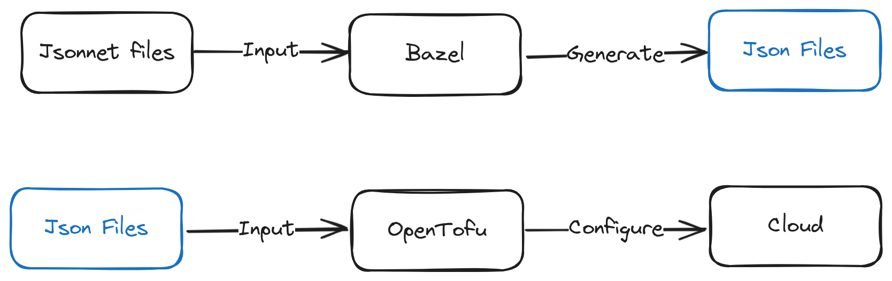

# Terramesos

[](https://github.com/semantic-release/semantic-release)

A monorepo with libraries and charms for provisioning resources in the Cloud.

This repository uses OpenTofu, Bazel and Jsonnet for modularization, management and provisioning of resources.



[excalidraw](https://excalidraw.com/)

## To use

Make sure Bazel is installed (use oficial documentation)

```sh
bazel test //:main
```

```
output
...
Target //:main up-to-date:
  bazel-bin/main.tf.json
```

Now, you can use the json to execute opentofu. [[Docs Terraform](https://developer.hashicorp.com/terraform/language/syntax/json), [Docs OpenTofu](https://opentofu.org/docs/language/files/)]

```sh
opentofu plan
```